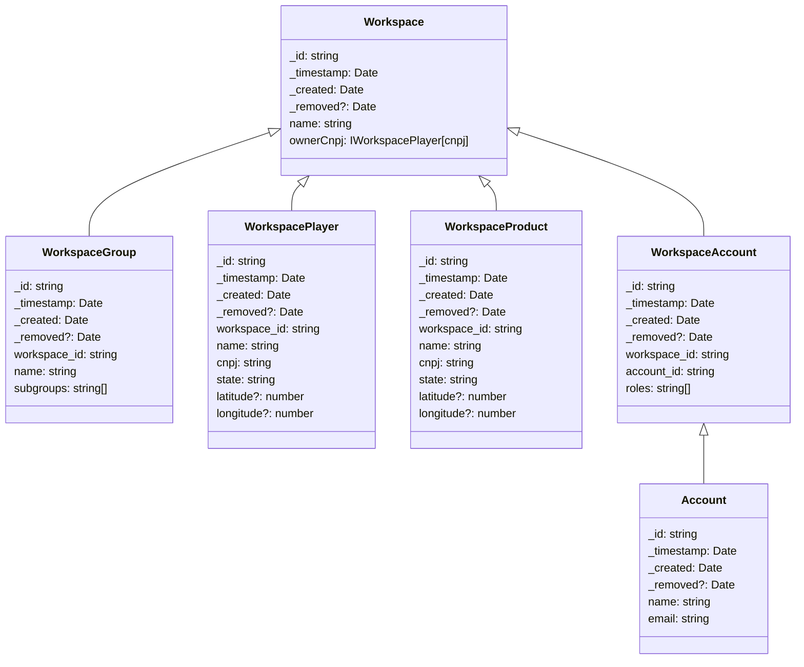

# Apure - Data API

Project created to manage user

## Architectural layers

## Database Structure

```mermaid
classDiagram
  Workspace <|-- WorkspaceGroup
  Workspace <|-- WorkspacePlayer
  Workspace <|-- WorkspaceProduct
  Workspace <|-- WorkspaceAccount
  WorkspaceAccount <|-- Account
  class Workspace {
    _id: string
    _timestamp: Date
    _created: Date
    _removed?: Date
    name: string
    ownerCnpj: IWorkspacePlayer[cnpj]
  }
  class WorkspaceGroup {
    _id: string
    _timestamp: Date
    _created: Date
    _removed?: Date
    workspace_id: string
    name: string
    subgroups: string[]
  }
  class WorkspacePlayer {
    _id: string
    _timestamp: Date
    _created: Date
    _removed?: Date
    workspace_id: string
    name: string
    cnpj: string
    state: string
    latitude?: number
    longitude?: number
  }
  class WorkspaceProduct {
    _id: string
    _timestamp: Date
    _created: Date
    _removed?: Date
    workspace_id: string
    name: string
    cnpj: string
    state: string
    latitude?: number
    longitude?: number
  }
  class WorkspaceAccount {
    _id: string
    _timestamp: Date
    _created: Date
    _removed?: Date
    workspace_id: string
    account_id: string
    roles: string[]
  }
  class Account {
    _id: string
    _timestamp: Date
    _created: Date
    _removed?: Date    
    name: string
    email: string
  }
```